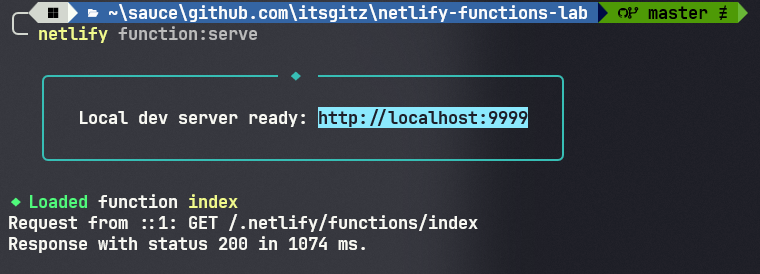
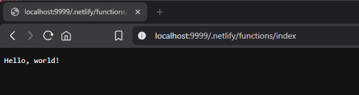

# netlify-functions-lab

A repository for experimenting with Netlify Functions.

# Usage

Before deploying the function (committing and pushing), you can test it locally using the [Netlify CLI](https://cli.netlify.com/) with the following command:

```sh
netlify functions:serve
```

You can then access the function locally at the following URL, which is based on the `index.mts` file in this repository: <http://localhost:9999/.netlify/functions/index>.

1. Example of the command running:



2. Example of the result:

